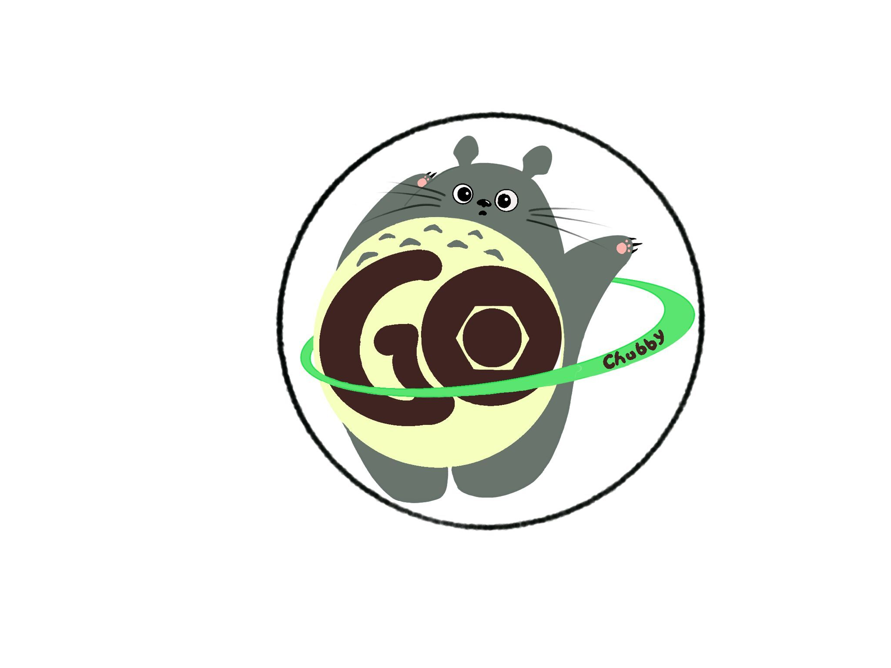

# ChubbyGo

This cute Totoro's name is Go, and he may be a friend of Tux!
这个可爱的龙猫的名字叫做Go，他也许是Tux的朋友！

## Description

要运行ChubbyGo需要引入以下两个三方库：
1. github.com/sony/sonyflake
2. github.com/OneOfOne/xxhash

## Introduction

ChubbyGo是一个基于Raft协议的分布式锁服务，其提供了在低耦合分布式系统中粗粒度的锁定和可靠的存储。

大家也许都知道Chubby其实是2006年谷歌发表的论文《The Chubby lock service for loosely-coupled distributed systems》中描述的服务，但是是闭源的，后来雅虎研究院将一个类似的项目捐献给了Apache基金会，这个项目的名字叫做ZooKeeper。ZooKeeper实现了更高级别的抽象，以实现一个分布式协调中心，以此留给客户端更多的自由，但相应的带来了复杂度。为了更简单的使用，我根据论文实现了Chubby，并命名为ChubbyGo。

ChubbyGo目前实现的功能：

1. raft基础协议完成，包括：领导人选举，日志复制，日志压缩；集群关系变更暂未实现。
2. 基于raft协议完成强一致性的键值服务。
3. 服务器之间运行前的连接：修改为超时时间倍增的重传，以抹平各机器服务器启动的时间差。
4. 配置项提取出来，配置文件使用json。
5. 出现环状引用：使用Listener模式解决。
6. 使用服务器拒绝服务使得多服务器同步启动协议，见RaftKV.ConnectIsok，集群部署成功。
7. 客户端实现在连接大于等于N/2+1机器时提供服务，而且在连接大多数服务器之后剩下未连接服务器
会不断重连，当大于N/2+1的机器超时时客户端直接退出，报错为超时。
8. flake算法初始机器标识符生成函数是拿内网IP计算，客户端使用会有很大问题，所以加入了自定义的机器标识符生成函数 。
9. 持久化完成，模仿Redis提供三种策略:always,everysec,no。
10. 允许服务器宕机重启，并读取持久化数据，并重新加入原集群，整个集群继续对外提供服务。
11. 实现类Unix文件系统接口以提供编程人员更熟悉的分布式锁接口;文件系统的权限信息现在很模糊，
不知道该如何提供一个客户可用的权限表示形式，其中ACL现在没用;
12. 可以引入线程安全的哈希map提升并发度，并进一步支持fastget操作;

ChubbyGo文件系统中定义的行为：
1. "/ls"为所有ChubbyGo Cell的初始根目录。
2. open可以打开一个文件或者文件夹，并返回一个文件描述符。
3. 我们可以使用一个目录的文件描述符在其中create一个文件或者文件夹，默认open，并返回文件描述符。
4. open操作会增加文件或者目录的引用计数。
5. 使用完毕需要使用close(delete加参数)操作。
6. close可以减小文件的引用计数，临时文件当计数为零时自动删除，永久文件和文件夹则不会删除。
7. delete可以加参数，当文件引用计数为零的时候直接删除任意文件或者目录。
8. 可以对每一个ChubbyGo Cell内除了根目录以外的目录加锁，即根目录可以打开，无法被加锁。
9. 当打开一个文件时我们可以对其进行加锁操作，支持读锁和写锁。
10. 加锁以后需要解锁。

## Thanks
感谢李浩提供了一种更优的服务器启动时间间隔处理函数。

感谢李怡提供了ChubbyGo Logo第一版与第二版的设计，由此才产生了Go这个可爱的小家伙儿。